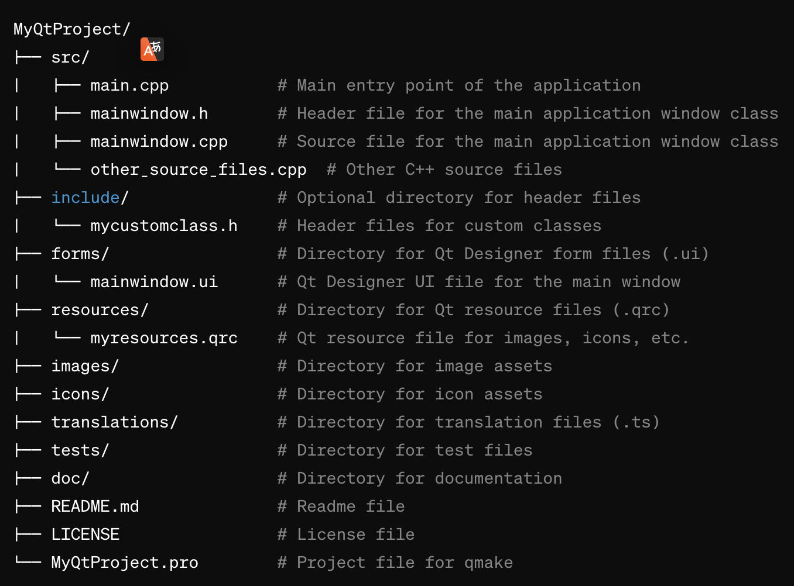

# Cliet subproject

Here will be all the components related to the client subproject. The file structure in the `client/` directory may look as the following (perhaps, autogenerated by the Qt framework):

You will need the `client` project to be able to use proto-models, thus it should be addressed inside the root [`CMakeLists.txt`](../CMakeLists.txt).